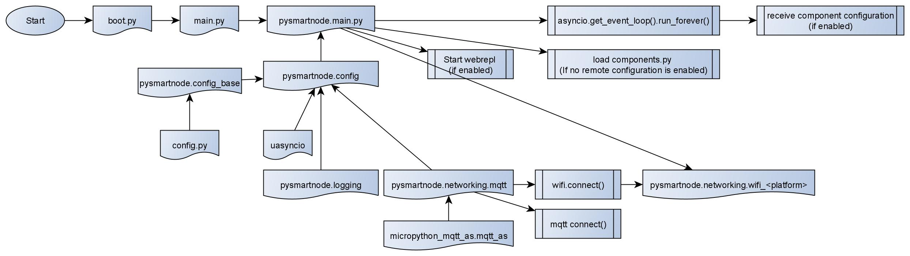

# Micropython SmartHome Node

This repository provides a general framework to deploy smarthome nodes based on micropython and communicating using mqtt.
The framework is easy to use and extend with custom components/scripts.

## Why another framework?

Many SmartHome frameworks are based on C(++) which makes extending them more difficult. 
In micropython environment there are a lot less frameworks and often have a difficult documentation or None and are either complex or do not have enough features.
So I decided to build one myself with the following points in mind:

* This framework aims to be easy to use and easy to extend with custom scripts and components.
* The documentation should be easy to understand and as short as possible while still giving a clear path of how to use the project and integrate your components.
* The project structure should be easily understandable, no guessing which files are loaded when and by what
* Provinding templates as example and help of how to make new components, etc.
* Be reliable (Have a reliable connection using mqtt, do not fail if a component fails, ...)
* Comment as much as possible so that anyone can understand what a file or configuration option is for


## 1.Hardware

The project is compatible with ESP32 and ESP8266 microcontrollers.

### ESP8266

This works pretty well, version >3.0 has even more stable code but sadly also a huge RAM requirement.
With version 3.4 it was still possible to run this project with an activated filesystem and have a few components. 
Sadly version 3.8. is unusable if the filesystem is activated. I will work on a solution and clean up the code to free more RAM.

However if you disable the filesystem, this frees up more than 4kB of RAM. 
With this I am able to run I2C, HTU21D, Buzzer, LED, RAM publishing, a debug component and still have 5kB of RAM available, which is enough for a few more components. 

### ESP32

Only tested on loboris fork which also supports SPRAM. Works well on this port and can be considered almost stable. I did not set up an ESP32 to run continuosly yet and my unit has a faulty flash.

Official ESP32 port is not yet tested but if asyncio works, so will this project. Not all of the components are supporting it and help is needed here.


## 2.Getting started

### 2.1. Program files

To clone this repository run
```
git clone https://github.com/kevinkk525/pysmartnode
cd pysmartnode
git submodule update --init --recursive
```

To update run inside the repository directory
```
git pull
git submodule update --recursive --remote
```
You should have the latest micropython firmware and include the directory "pysmartnode" as frozen bytecode into your firmware. (Put it in the "module" directory before building the firmware)
On ESP32 frozen bytecode is not neccessary but should be considered if not using psram.

### 2.2. Dependencies

Required external modules are:

* uasyncio (>=V2.0)
* uasnycio-core (>=V2.0)
* micropython-mqtt-as, my own fork that has small changes ([mqtt_as](https://github.com/kevinkk525/micropython-mqtt)) 

All required modules are in this repository and don't need to be aquired manually. 
Just put the directories `micropython_mqtt_as` and `uasyncio` from `external_modules` into your `modules` directory before building the firmware or run the correct script in section `Tools`.
The *micropython_mqtt_as* dierectory is a submodule to my repository so this will be updated automatically.
Uasyncio is copied from the official repository and I will update the file as soon as a new version is published.

## 3. Components
The included components can be found in the directory "pysmartnode/components".
Their description and configuration will soon be added to the wiki but for now you can check the files itself. 
They contain an example configuration of the component and some description. 
The example configuration however is in [hjson](https://github.com/hjson/hjson-py), which is easier than *json* and has the possibility to have comments in it.
This format is used in the *SmartServer* (see 4.1.), if you want to put the configuration onto your controller, you have to convert it to json.

Every added component will be published as *log.info* to *<home>/log/info/<device_id>*. If it contains the variable *__version__* then this will be published as well to make keeping track of component version easier. 

### Sensor-API

Components can be and do anything. Sensors however all have a similar API to have a standardized usage.
For example all temperature sensors provide the function (coroutine actually) *sensor.temperature(publish=True)* that returns the temperature as float and takes the argument *publish=True* controlling if the read value should be published to mqtt in addition to reading the value.
This should make working with different types of sensors easier. If you are e.g. building a heating controller and need a temperature from some sensor, you can just connect any sensor and provide the heating code with that sensor by configuration. 
As every temperature sensor has the function (actually coroutine) *temperature()* returning the current temperature in float (or None on error) it does not care about which sensor is connected.

### Sensor-Template
To make building new components easier, there is a [template](./_templates/sensor_template.py).

### Component-Template

As components have some kind of API too, there is a [template](./_templates/component_template.py).
It should help understanding how the configuration can be read and mqtt subscriptions and publishing values works.


## 4.Configuration

To run the pysmartnode on boot, just use the included "main.py".

The environment specific configuration is done within the "config.py" file that has to be put in the root directory of your microcontroller (or if frozen in "modules"). Copy the "config_example.py" to "config.py" and change it according to your needs.
In this file you have to specify the WIFI and MQTT details of your home environment.
There are also some optional parameters to configure base modules and behaviour.

### Project configuration
The project configuration is done in the file *config.py* which should be created by copying the [config_example.py](./config_example.py).
If you have a filesystem, copy it to there or put it as frozen bytecode in your modules directory.

The basic configuration options are:
* WIFI: SSID and PASSPHRASE
* MQTT: HOST, USER and PASSWORD

Optional configurations for the network are:
* MQTT_KEEPALIVE: the keepalive interval, if the device does not send a ping within this interval, it will be considered offline
* MQTT_HOME: the mqtt root topic
* MQTT_RECEIVE_CONFIG: states if the device should receive its configuration using mqtt subscription. This only works when using [SmartServer](https://github.com/kevinkk525/SmartServer) in your network

Platform dependend options are
- for esp8266:
    * LIGHTWEIGHT_LOG: if a logging module with less RAM demands should be used (saves ~500B)
    * MQTT_MINIMAL_VERSION: if a mqtt module should be used that is stripped to only the needed things (saves ~200B)
    * RTC_SYNC_ACTIVE: if and RTC time sync should be done (saves ~600B)
    * USE_SOFTWARE_WATCHDOG: As some of my esp8266 occasionally get stuck for 1h 10minutes but not the interrupts, this makes using a software watchdog possible to reset hanging units (uses ~600B)
- for esp32_LoBo:
    * MDNS_ACTIVE, MDNS_HOSTNAME, MDNS_DESCRIPTION: mdns options
    * FTP_ACTIVE: enable the built-in ftp server, very nice to have
    * TELNET_ACTIVE: enable the built-in telnet server to access the repl over wifi
    * RTC_SYNC_ACTIVE, RTC_TIMEZONE: enable RTC time sync and set the time server

A few additional options define some constants:
* INTERVAL_SEND_SENSOR: defines an interval, in which sensors are publishing their value if no interval is provided in the component configuration
* DEBUG: Will display additional information, useful for development only
* DEBUG_STOP_AFTER_EXECUTION: normally if an uncatched exception occurs and the loop exits, it will send a log and reset the device. This disables it and will stop at the repl after the exception.
* GC_INTERVAL: if the component ".machine.RAM" is active, this is the interval in which the garbage collection will be run
* INTERVAL_SEND_RAM: if the component ".machine.RAM" is active, the free RAM will be published in this interval

### Component configuration
The configuration of all components used on a microcontroller can be configured in different ways:

#### 4.1. Using SmartServer
To configure the used components it is possible to run [SmartServer](https://github.com/kevinkk525/SmartServer) in your network, which holds the configuration of each microcontroller and publishes it over MQTT when requested.
This makes it very easy to change configurations but makes the SmartHome less secure as the configuration is not fixed on the device itself.
The received configuration is stored locally to be able to recover from power outages even if the SmartServer is offline. For storing offline the method 3.1.2.1. is used on the ESP32 and 3.1.2.2. is used on the ESP8266 as these are the preffered methods.
Another benefit of using the SmartServer is that it collects the log messages that this framework publishes over MQTT.


#### 4.2. Using local configuration
The local configuration can be done in 3 ways, either using one file, "components.json" containing all neccessary information, or by using one file for each component, or by using a file "components.py" that can be a frozen module.
These are only used if either no configuration could be received from the SmartServer or receiving the configuration is disabled.

##### 4.2.1. Single .json-file component configuration
This configuration is only recommended on the ESP32 as it has enough RAM to process a bigger dictionary while loading components.
The file structure is the following, shown as hjson for improved readability so you have to make it a json dictionary before using. (Explained more clearly in the Wiki)

```
{
  _order:   # order in which the components are being loaded (as htu depends on i2c), if not defined dict.keys() will be used
  [
    i2c
    htu
  ]
  i2c:
  {
    package: .machine.i2c           # short package path included packges (for pysmartnode.components.machine.i2c)
    component: I2C                  # class or function name inside module
    constructor_args:               # arguments for the contstructor (in case of class) or function arguments (can be list or dict)
    [
      D6                            # string pin name for esp8266 NodeMCU
      D5
    ]
  }
  htu:
  {
    package: .sensors.htu21d
    component: HTU21D
    constructor_args: {
        i2c: i2c                    # i2c object created before, is being looked up in already registered components
        #mqtt_topic: sometopic      # optional, defaults to defaults to <home>/<controller-id>/HTU
        #interval: 600              # optional, defaults to 600s
        precision_temp: 2           # precision of the temperature value published
        precision_humid: 1          # precision of the humidity value published
        temp_offset: -2.0           # offset for temperature to compensate bad sensor reading offsets
        humid_offset: 10.0          # ...             
    }
}
```

##### 4.2.2. Multiple .json-files component configuration
This configuration is highly recommended on the ESP8266 as it saves some RAM during the loading process of the components.
This method splits the single file structure into different files:
	
* "_order.json": contains the array of the components and is used to load the correct files
* "components": folder that contains all components
* <component_name>.json: contains the dictionary of the component, see "htu" dictionary of *Single .json-file component configuration*; has to have the same name as in _order.json but can be chosen freely.

It will only be loaded if no *components.json* can be found, otherwise the *Single .json-file component configuration* is being used.

##### 4.2.3. components.py configuration
This configuration can be used if you plan on freezing the component configuration or do not have a filesystem activated to save some RAM.
If the *components.py* module has a *COMPONENTS* dictionary, this will be used just like the *Single .json-file component configuration* dictionary.
Don't save it as a .json string but as a python dictionary.

Alternatively you can use this module to register components as you see fit or add your own functions to the asyncio loop.
See the template for the components.py file in the template directory [here](./_templates/components.py). 

It will only be loaded if both the *Single .json-file component configuration* and the *Multiple .json-files component configuration* are unavailable. 

#### 4.3. Configuration options

The basic configuration options of a component are:
* package:                  The python package location, the "." means that it is in *pysmartnode.components*
* component:                The component is the class name or function/coroutine name. A component started by a function is called a "service"
* constructor_args:         These are the arguments for the constructor of the component class or function/coroutine. It can be a dictionary or a list but a dictionary is preferred as it makes the configuration more readable.

Addionally the following configuration can be given:
* init_function:            If the class constructor does not start everything needed, then an additional initialization function/coroutine can be specified to e.g. start sensor readings
* init_args:                This works like the *constructor_args*
* call_function_regularly:  A function/coroutine that should be called regularly can be defined here. This can be a sensor reading or an led blink. 
* call_interval:            The interval in which the function is called

The additional configuration options make it possible to run any library, even not designed specially for usage with pysmartnode.
Of course these libraries won't be able to use the mqtt component but the possiblity is there if it helps someone.

#### 4.4. Example component configuration

To quickly test this project I'd like to give an example.
Create a file "components.py" and put the following dictionary into it.

```
COMPONENTS = {
    "_order": ["ram"],
    "ram": {
        "package": ".machine.ram",
        "component": "ram",
        "constructor_args": {
            "interval": 60
        }
    }
}
```

This will load the component "ram" which will now publish the current free ram every 60s to the mqtt topic *<mqtt home>/<controller id>/ram_free*

Alternatively you can put the dictionary directly into a file with the name "components.json".

## 5. Tools

The tools directory contains a lot of scripts I use to synchronize the project files with the build directory of the microcontroller and for building and flashing firmwares.
They are heavily specialized to my environment and mostly for usage in eclipse as an external tool although I'm using PyCharm mainly now.
I'm not that skilled in making these very generally usable but I keep them in the repository in case someone finds them useful or even contributes better ones. (Would be very happy about that!)

## 6. Structure overview

A small overview of the directory structure:

 * /:                   contains a modified boot.py usable on esp8266 and esp32, the project configuration file, ...
 * _templates:          contains templates for building own scripts/components/config.. not to be uploaded to the device
 * _testing:            contains tests of some modules, not needed on the device
 * external_modules:    contains the needed external modules like mqtt_as and uasyncio. Can be ignored if the dependencies of this project are available.
 * pysmartnode :        contains the project files, the configuration library and main startup script
    * components:       contains all the component libraries grouped by type
        * devices:      libraries for controlling external devices
        * listeners:    only listen to events, e.g. a door bell
        * machine:      libraries for controlling the device (gpio, watchdog, ...)
        * multiplexer:  all sorts of multiplexer: mux, analog-mux, passthrough-mux (analog-mux used as digital passthrough)
        * sensors:      all kinds of externally connected sensors
    * libraries:        contains general device libraries not specific to pysmartnode
    * logging:          logging implementations sending log messages by mqtt
    * networking:       wifi and mqtt handling
    * utils:            helping functions, decorators and wrappers. May be helpful in some custom components. Example: asyncio Event class
        * subscriptionHandlers:     used in mqtt library to manage subscriptions. Different implementations with different strengths and weaknesses. Shortly described in [mqtt.py](./pysmartnode/networking/mqtt.py)
        * wrappers:                 wrappers for all sorts of things
        
## 7. Project Flowchart

I'd like to provide a small flowchart which makes it easier to understand how this project works and which file is called when.
It shows which modules are imported by which files first (as some are imported in different files of course) in a temporal flow. Only the most important modules are shown, not util modules.




## 8. Contributors

* **Kevin Köck** - *Author* 

## 9. License

This project is licensed under the MIT License - see the [LICENSE.md](./LICENSE.md) file for details.

## 10. Acknowledgments

* Thanks to Peter Hich for providing *mqtt_as*
* Thanks to anyone whose code was an inspiration

**The Readme is not yet finished and the wiki not yet started**